<!-- ────────────────────────────────────────────────────────── -->
<!--  CONTRIBUTION HEATMAP                                     -->
<!-- ────────────────────────────────────────────────────────── -->

<h3><code>hxni@cipher ~ $ ./contributions.sh</code></h3>

  

<!-- ────────────────────────────────────────────────────────── -->
<!--  ASCII PORTRAIT + NEOFETCH CARD                           -->
<!-- ────────────────────────────────────────────────────────── -->

<h3><code>hxni@cipher ~ $ neofetch</code></h3>

<table>
  <tr>
    <td valign="top">
      
    </td>
    <td valign="top">
      
    </td>
  </tr>
</table>

<!-- widths: 370 + 490 = 860 → aligns with heatmap above -->

 

<!-- ────────────────────────────────────────────────────────── -->
<!--  LINKS                                                    -->
<!-- ────────────────────────────────────────────────────────── -->

<h3><code>hxni@cipher ~ $ cat .links</code></h3>

